<div align="center">

# MediKiosk

### AI-Powered Ayurveda Clinical History Platform

**Patient-first • Multilingual • Voice-enabled • Adaptive • Privacy-aware**

[](https://medikiosk-the-synergist.vercel.app)
[](https://react.dev/)
[](https://www.typescriptlang.org/)
[](https://vite.dev/)
[](https://tailwindcss.com/)

> **"Your Story. Better Care."**

</div>

---

## Overview

MediKiosk is a patient-facing **AI-powered Ayurveda clinical history platform** designed to improve the first-mile clinical history-taking experience in hospital OPDs.

The platform guides patients through a structured, multilingual and accessible workflow using **voice + touch**, while preparing a foundation for medical-document digitization, structured clinical summaries and future HIS/ABDM-compatible integration.

### Core principle

> **Do not ask every Ayurveda question to every patient. Ask the next question only when the previous answer makes it relevant.**

MediKiosk supports clinicians rather than replacing them. The system is intended to collect, structure and communicate patient information; **clinical diagnosis and final decisions remain with qualified healthcare professionals.**

---

## Live Demo

**[Open MediKiosk](https://medikiosk-the-synergist.vercel.app)**

**[GitHub Repository](https://github.com/farhan9865/MediKiosk-The-Synergist-)**

---

## The Problem

High-volume OPDs can face limited consultation time, staff constraints and incomplete histories. Ayurveda history can require detailed information, while patients may bring fragmented paper prescriptions, laboratory reports, discharge summaries and handwritten documents.

MediKiosk addresses the first-mile workflow:

```text
Patient
  ↓
Language + Consent
  ↓
Guided Voice / Touch History
  ↓
Adaptive Ayurveda Question Engine
  ↓
Document Intake
  ↓
Structured Clinical Summary
  ↓
Physician Review
  ↓
Future HIS / FHIR / ABDM Integration
```

---

## Key Features

### Conversational Ayurveda History
- Complaint-first history flow
- Complaint-specific follow-up questions
- Prakriti context
- Vikriti/current-condition context
- Agni and Koshtha
- Nidana and Samprapti
- Extensible Trividha / Ashtavidha / Dashavidha ontology
- Controlled question flow instead of unrestricted medical interviewing


## Prototype Screenshots

### Patient Experience

#### 1. Welcome Screen

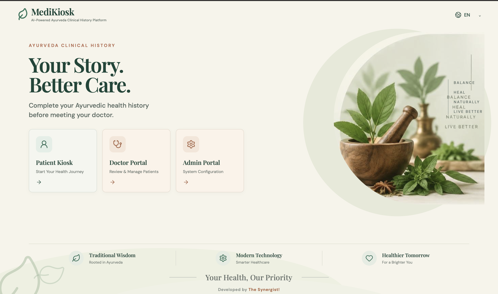

#### 2. Language Selection

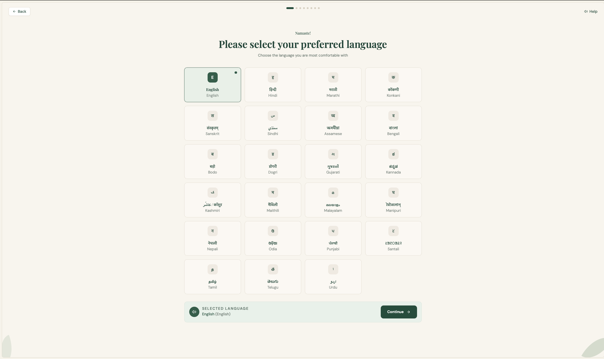

#### 3. Patient Identification

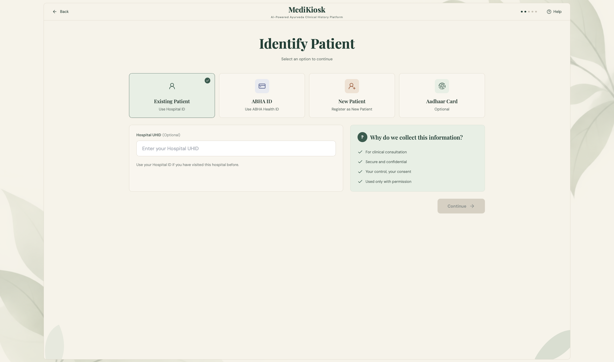

#### 4. Consent

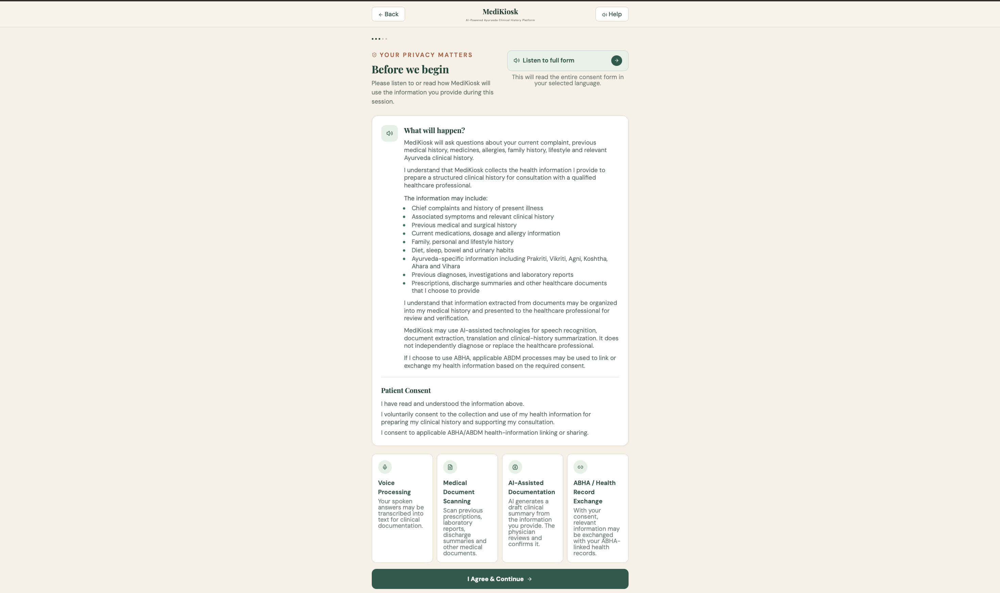

#### 5. Patient Demographics

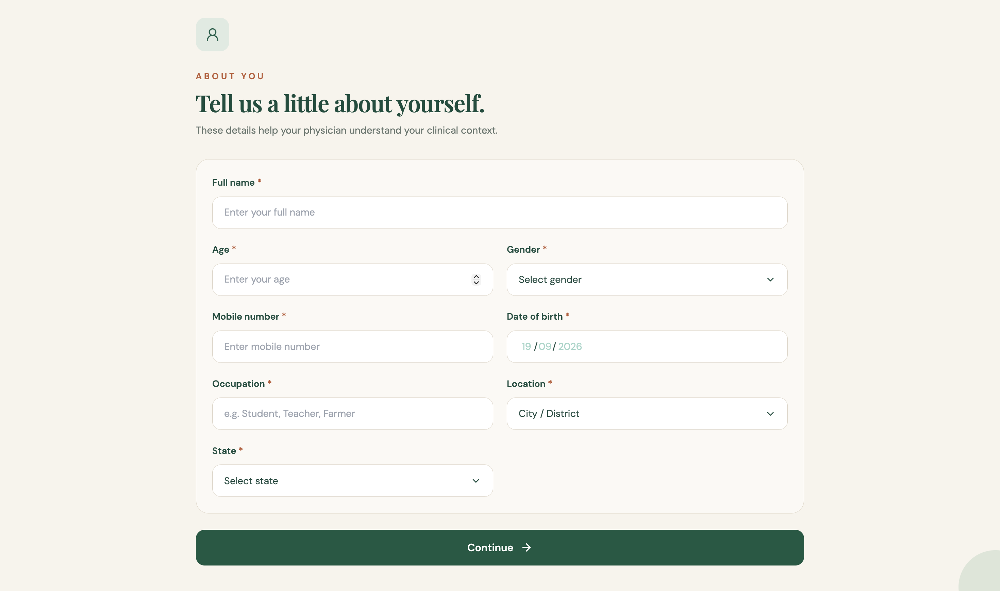

#### 6. Interaction Mode

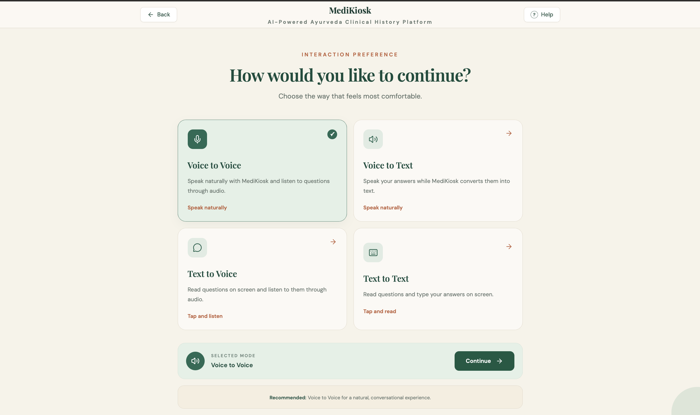

#### 7. Adaptive Ayurveda History

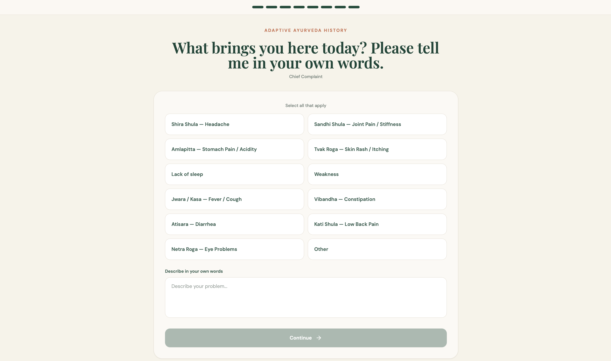

#### 8. Document Upload

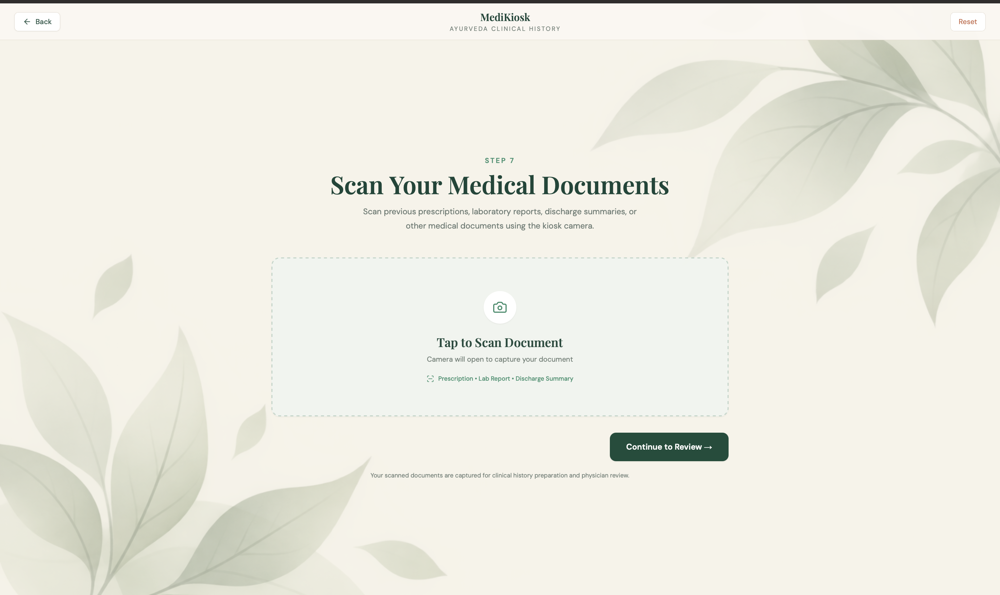

#### 9. History Review

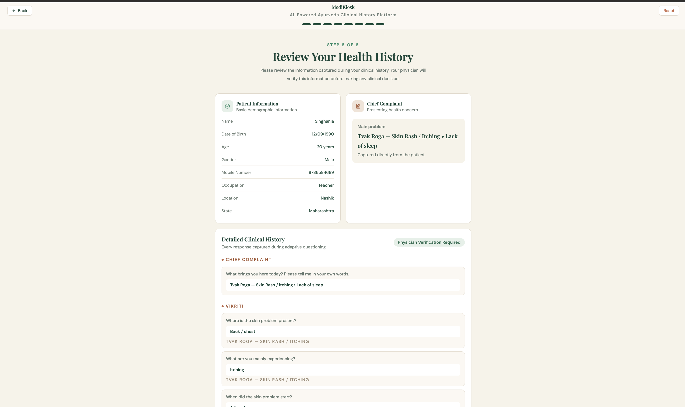

#### 10. History Complete

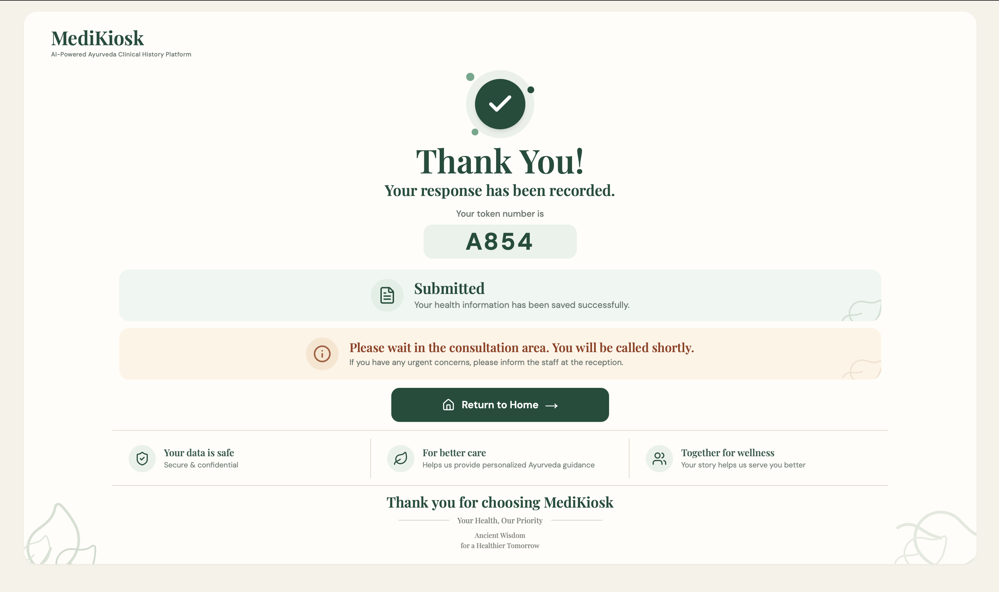

---

### Doctor Portal

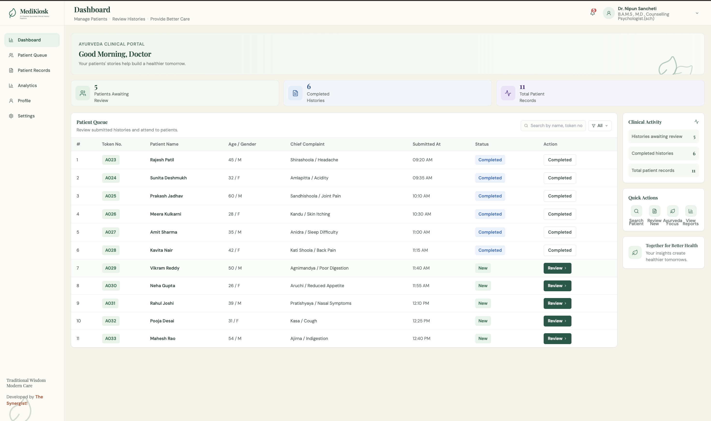

---

### Admin Portal

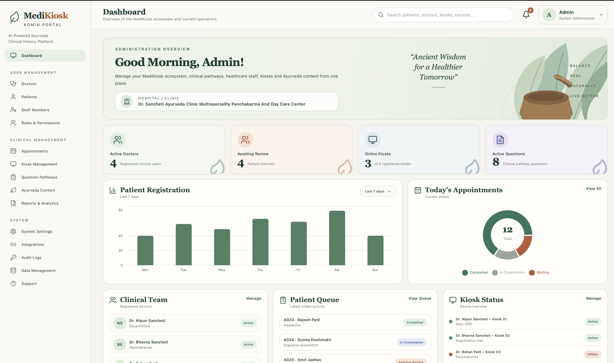

### Four Interaction Modes

| Mode | Experience |
|---|---|
| Voice-to-Voice | Speak naturally and listen to questions |
| Voice-to-Text | Speak answers while they are converted to text |
| Text-to-Voice | Read questions and listen to them |
| Text-to-Text | Read and type answers |

### Multilingual Experience

The workflow supports the 22-language set defined for MediKiosk:

**English, Hindi, Marathi, Konkani, Sanskrit, Sindhi, Assamese, Bengali, Bodo, Dogri, Gujarati, Kannada, Kashmiri, Maithili, Malayalam, Manipuri, Nepali, Odia, Punjabi, Santali, Tamil, Telugu and Urdu.**

Question IDs and structured values remain language-independent.

### Adaptive Complaint Paths

The prototype contains pathways for:

- Shira Shula — Headache
- Sandhi Shula — Joint Pain / Stiffness
- Amlapitta — Stomach Pain / Acidity
- Tvak Roga — Skin complaints
- Anidra — Sleep difficulty
- Daurbalya — Weakness / Fatigue
- Jwara / Kasa — Fever / Cough
- Vibandha — Constipation
- Atisara — Diarrhea
- Kati Shula — Low Back Pain
- Netra Roga — Eye problems
- Other — Patient-described complaint

### Patient Identification
- Existing Patient
- ABHA ID
- New Patient
- Aadhaar Card

### Document Intelligence Foundation
Planned/architected capabilities include prescription, laboratory and discharge-document intake; multilingual/handwritten OCR; extraction of medicines, investigations and procedures; timeline construction; and physician-attention highlighting.

> Production OCR and clinical extraction are separate implementation stages and should not be assumed from the current frontend prototype.

### Physician-Centric Summary

```text
Chief Complaint
      ↓
History of Present Illness
      ↓
Past Medical / Surgical History
      ↓
Drug & Allergy History
      ↓
Family History
      ↓
Personal History
      ↓
Review of Systems
      ↓
Previous Investigations
      ↓
Ayurveda-Specific History
```

The physician remains the final reviewer.

---

## Ayurveda Clinical Model

MediKiosk is designed around:

| Section | Purpose |
|---|---|
| Trividha | Ayurveda history framework |
| Ashtavidha | Ayurveda examination/history framework |
| Dashavidha | Patient assessment context |
| Prakriti | Stable patient context |
| Vikriti | Current condition/lifestyle context |
| Agni | Digestive/metabolic context |
| Koshtha | Bowel-function context |
| Ahara-Vihara | Diet/lifestyle context |
| Nidana | Trigger/causative-factor context |
| Samprapti | Disease-process progression context |

### Dashavidha

Prakriti • Vikriti • Sara • Samhanana • Pramana • Satmya • Sattva • Ahara Shakti • Vyayama Shakti • Vaya

Detailed clinical subquestions should be maintained through a clinician-reviewed question ontology.

---

## Adaptive Question Engine

MediKiosk is intentionally **not a giant static questionnaire**.

```text
Chief Complaint
      ↓
Complaint Classification
      ↓
Relevant Vikriti Questions
      ↓
Prakriti Context
      ↓
Agni / Koshtha
      ↓
Relevant Nidana
      ↓
Samprapti
      ↓
Documents
      ↓
Structured Summary
```

The next question should depend on the current complaint, previous answers, clinical context, dependencies and questions already answered.

---

## AI / Clinical-Safety Boundary

The intended architecture separates AI/NLP functions from clinical decision-making.

```text
Speech Recognition
       ↓
Structured Extraction
       ↓
Question Engine / Clinical Rules
       ↓
Structured Patient Data
       ├── Physician Summary
       ├── Document Timeline
       └── Future HIS / FHIR / ABDM
```

AI/NLP can support speech recognition, extraction, translation, summarization and explanation.

**The system should not autonomously diagnose or prescribe.**

---

## System Architecture

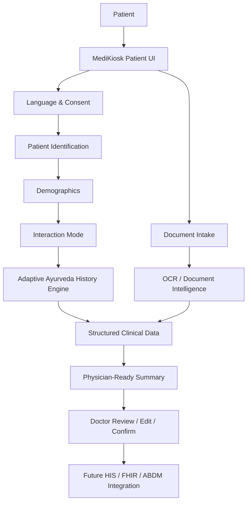

---

## Technology Stack

### Current Frontend
- React
- TypeScript
- Vite
- Tailwind CSS
- React Router
- Zustand
- Lucide React
- Browser Speech APIs

### Planned / Integration Layer
- FastAPI
- PostgreSQL
- Redis
- OCR services
- Clinical question ontology
- AI/NLP services
- FHIR-compatible exchange
- HIS / ABDM integration

---

## Application Routes

```text
/                         Home
/patient                  Patient Kiosk
/patient/language         Language
/patient/identify        Identification
/patient/consent         Consent
/patient/demographics    Demographics
/patient/mode            Interaction Mode
/patient/history         Adaptive History
/patient/documents       Documents
/patient/review          Review
/patient/thank-you       Completion
/doctor                   Doctor Portal
/admin                    Admin Portal
```

---

## Project Structure

```text
MediKiosk/
├── docs/
├── public/
├── src/
│   ├── components/
│   │   ├── common/
│   │   ├── patient/
│   │   ├── doctor/
│   │   └── admin/
│   ├── pages/
│   │   ├── patient/
│   │   ├── doctor/
│   │   └── admin/
│   ├── services/
│   │   ├── speech/
│   │   ├── questionEngine/
│   │   └── documents/
│   ├── store/
│   ├── i18n/
│   ├── data/
│   ├── types/
│   └── styles/
├── .gitignore
├── package.json
├── package-lock.json
├── vercel.json
└── README.md
```

---

## Getting Started

```bash
git clone https://github.com/farhan9865/MediKiosk-The-Synergist-.git
cd MediKiosk-The-Synergist-
npm install
npm run dev
```

Production build:

```bash
npm run build
```

Preview:

```bash
npm run preview
```

---

## Deployment

**Live:** https://medikiosk-the-synergist.vercel.app

```text
Local Development
      ↓
     Git
      ↓
   GitHub
      ↓
   Vercel
      ↓
 Production
```

---

## Prototype Status

### Implemented / demonstrated
- [x] Landing page
- [x] Patient kiosk flow
- [x] Multilingual language selection
- [x] Patient identification
- [x] Consent workflow
- [x] Demographics
- [x] Four interaction modes
- [x] Adaptive history interface
- [x] Complaint-specific pathways
- [x] Voice interaction foundation
- [x] Ayurveda-oriented sections
- [x] Document intake workflow
- [x] Review workflow
- [x] Doctor Portal
- [x] Admin Portal
- [x] Production build
- [x] Vercel deployment

### Production / integration roadmap
- [ ] Secure backend
- [ ] Secure patient data ownership
- [ ] Production OCR
- [ ] Handwriting extraction validation
- [ ] Full clinician-reviewed question ontology
- [ ] Red-flag routing
- [ ] FHIR implementation
- [ ] HIS integration
- [ ] ABDM production integration
- [ ] Offline synchronization
- [ ] Clinical validation
- [ ] Security/compliance validation

---

## Clinical Safety

MediKiosk is a **clinical workflow support prototype**.

It should not independently:
- diagnose disease
- prescribe treatment
- replace a qualified Ayurveda physician
- present unverified AI output as clinical fact

Real-world deployment requires appropriate clinical, privacy, security, accessibility, translation and legal/compliance validation.

**Never commit real patient records, medical documents, API keys, passwords or secrets to this repository.**

---

## Documentation

- [Project Report](docs/MediKiosk_Project_Report.docx)
- [Architecture](docs/ARCHITECTURE.md)
- [Security](SECURITY.md)

---

## The Synergist!

**Traditional Wisdom • Modern Technology • Healthier Tomorrow**

**Developed by The Synergist!**

